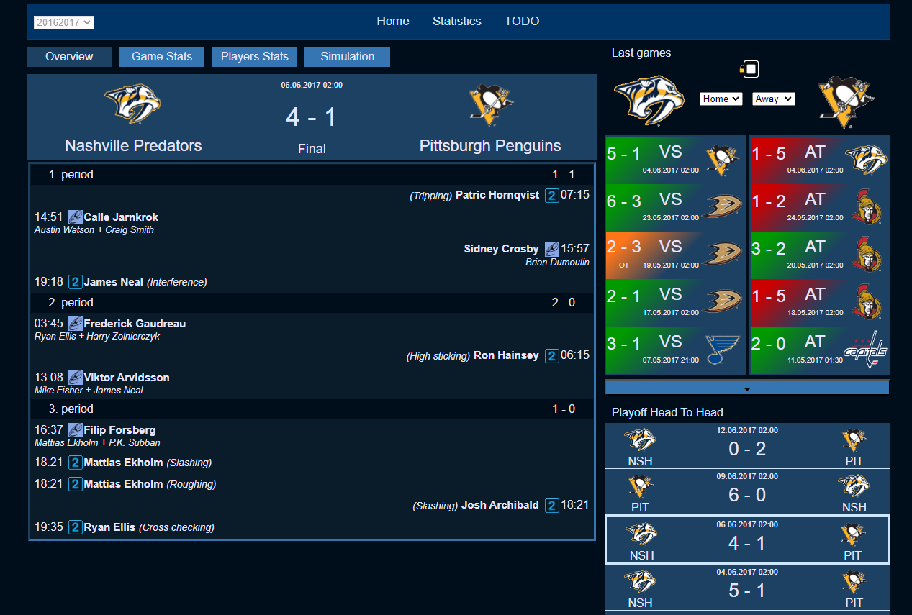

# NHLApp_v2

Dynamic web project showing data from Oracle db, that are loaded from api [NHLDataLoader2](https://github.com/Tomas-Mas/NHLDataLoader_v2/) to html pages.

## Technologies
- Java 8  
- Oracle 19  
- Maven  
- Spring Web MVC  
- JPA/Hibernate (HQL, JPA criteria API)  
- HTML, JSTL, CSS, Javascript  

## General description
User request are served by Spring controllers.  
Data are retrieved from db using HQL for simple queries, JPA criteria API for more complex queries.  
Html page is then filled by retrieved data and styled with CSS and Javascript.

## Pages

### Main page

- sub-navigation (regulation/playoff and overall/home/away data) requests are handled by javascript, then whole stats container is overwritten by controller's response

- game details are loaded on click on game row by javascript into data row
### Stats page

- all the sub navigation including pagination of player's stats is binded to single class through form

### Game page
#### Overview

### Player page
TODO
### Team Page
TODO