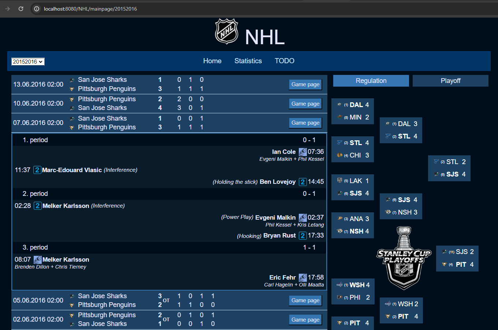

# NHLApp_v2

Dynamic web project displaying data from Oracle db, that are loaded from api [NHLDataLoader2](https://github.com/Tomas-Mas/NHLDataLoader_v2/) to html pages.

## Technologies
- Java 8  
- Oracle 19  
- Maven  
- Spring Web MVC  
- JPA/Hibernate (JPA criteria API)  
- HTML, JSTL, CSS, Javascript  

## General description
User request are served by Spring controllers.  
Data are retrieved from db using Hibernate/JPA criteria API.  
Html page is then filled by Javascript and styled by CSS.  
Sql scripts and views are in sql folder  
DB model:

## Pages
## Main menu
- navigation buttons
- season selector, that on change reloads page with given season. On some pages is disabled (e.g. game page where changing season wouldn't have any effect)

## Main page
#### Main content
- table with last x games (x = constant in /config/DefaultConstants.java)
- clicking table row will load game-keyevents-td.jsp view with key events for given game. Clicking it again will hide it, showing it again will just unhide it and won't require another request.
#### Sidebar
- contains statistics for entire season
- Regulation / Playoff radio buttons to switch between the two
- Playoff - shows playoff spider for current season. If season didn't reach playoff phase yet, it will build first round of playoff matches from current standings.
- Regulation - shows team standings for given season. radio buttons overall/home/away to filter stadings.

## Stats page
#### Main content
- contains detailed stats for given season (based off season selector in menu)
- navigation is done using radio inputs inside form with multiple levels: DataScope - teams/players, StandingsScope(if team tab is selected) - conferences/division, SeasonScope(if player tab is selected) - regulation/play-off, RegulationScope(for both team and player tab) - overall/home/away
- teams tab: tables detailed team standings for each conference or division, filtered by home/away/overall. Tables are sortable on header click (both direction) using javascript.
- players tab: table with detailed players stats for regulation or playoff, filtered by home/away/overall. Tables are sortable on header click (headers are radio inputs - part of form). Maximize button on top right, that hides/shows sidebar to expand table. Pagination below table for additional filtering includes count of all players, drop down for selecting how many players will be displayed in table, page selector, buttons for previous and next page.
#### sidebar
- playoff spider same as in game page

## Game page
- submenu with different tabs for game: Overview, Game stats, Player stats, Simulation
- using JS window.location.hash to navigate between tabs
#### Overview tab main content
- game header with most important game data (teams, score, status and game date)
- game detail - all key events (goals, penalties) for game displayed in order by each period - same view as in main page after clicking row in game list table
#### Game stats tab main content
- same game header as overview
- period subnavigation to display stats for each period separately or overall for entire game
- stats consists of two lines: line with numbers and name of stats (Shot on goal, Hits, etc.) and canvas line that is drawn using javascript to graphically display stats
#### Player stats tab main content
- same game header as overview and game stats tabs
- filter to choose displayed players team (or both), position and productive checkbox, that if checked displays only players, who have at least 1 point during game
- table is ordered by clicking headers
#### Overview, Game stats, player stats tabs sidebar - consists of 3 parts:
- regulation head to head - displays games between the two teams during regulation
- playoff head to head - displays games between the two teams during playoff
- last games - displays last 5 games for each team - can be expanded indefinitely by "show more" button. By default displays last home games for home team and away games for away teams, but that can be changed by users using drop down for both teams.
- all these games serve as navigation - clicking on them takes you to game page for the clicked game
- last games also contains "lock" checkbox, that locks sidebar - if you use sidebar navigation while lock checkbox is checked, only main section will load data of the clicked game, all 3 sections of sidebar will remain as they were
#### Simulation tab main content
- same game header as overview and game stats and player stats tabs
- game pitch img where all animations are run
- javascript load JSON array with all the events data for animations
- animations are controlled by multiple inputs: stop button - stop all animations and go to game start event, start button - start animations from selected starting point, speed drop-down - select speed multiplier for in-game second, previous/next button and range input - navigate to previous/next/any event starting point (only works when play button is not active)
#### Simulation tab sidebar
- navigation table with all events
- based on consts in javascript only displays x events before current event and y events after current

## Screenshots
### Main page

### Stats page

### Game page

